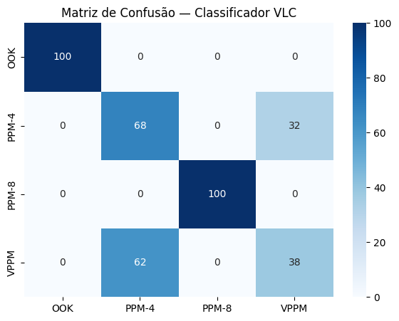
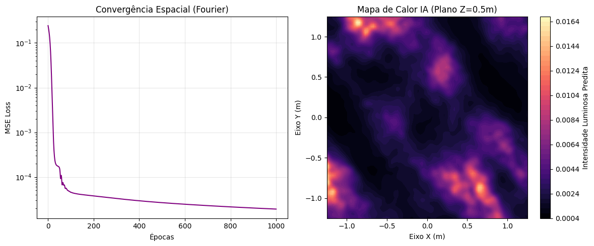

# VLC Digital Twin — Physics-Informed Neural Networks com NVIDIA PhysicsNeMo

[](LICENSE)
[](https://python.org)
[](https://pytorch.org)
[](https://github.com/NVIDIA/physicsnemo)
[](https://github.com/zyzerkk/vlc-digital-twin/actions)
[](#como-citar)
[](#)

> **Redes Neurais Informadas por Física (PINNs) aplicadas à modelagem de Gêmeos Digitais para
> canais de Comunicação por Luz Visível (Visible Light Communication — VLC)**

---

## Resumo

A Comunicação por Luz Visível (VLC) é uma tecnologia de acesso óptico sem fio que utiliza
diodos emissores de luz (LEDs) como transmissores de dados, explorando o espectro visível
(380–780 nm) como meio de propagação. A modelagem precisa do canal VLC — em particular a relação
sinal-ruído (SNR), o bloqueio de linha de visada (LOS) e a interferência entre múltiplos
transmissores em arranjos MIMO — é um pré-requisito para o projeto de sistemas de comunicação
óptica robustos.

Este repositório apresenta um framework de **Gêmeo Digital (Digital Twin)** para canais VLC
baseado em **Redes Neurais Informadas por Física (Physics-Informed Neural Networks — PINNs)**,
construído sobre o ecossistema [NVIDIA PhysicsNeMo](https://github.com/NVIDIA/physicsnemo)
(anteriormente Modulus). O framework combina dados observacionais com restrições físicas
derivadas do modelo de canal Lambertiano generalizado, permitindo que a rede neural respeite
leis físicas conhecidas mesmo em regiões do domínio com poucos dados de treinamento.

São apresentados cinco experimentos progressivos, do problema de predição de SNR em espaço livre
até um Gêmeo Digital MIMO-VLC completo com quatro transmissores, sombreamento e reconstrução de
campo de iluminância 3D.

---

## Contexto histórico da pesquisa

> Esta seção documenta a trajetória real do projeto — incluindo os obstáculos enfrentados —
> pois acreditamos que a transparência metodológica é parte da contribuição científica.

A pesquisa foi iniciada em **julho de 2023** no Google Colab, com o objetivo de integrar o
framework NVIDIA Modulus (à época hospedado no GitLab) com canais VLC. Os principais obstáculos
encontrados foram:

**Problema 1 — Link GitLab offline**
O repositório oficial da NVIDIA referenciado no tutorial estava inacessível (404). A solução
foi localizar manualmente o repositório em fontes alternativas e, posteriormente, o projeto
migrou para o GitHub em `github.com/NVIDIA/modulus`.

**Problema 2 — Incompatibilidade de versão Python**
O ambiente padrão do Google Colab (Python 3.11 à época) era incompatível com as dependências
do Modulus 22.09, que exigia Python ≤ 3.10. Tentativas de downgrade via ambiente conda no
Colab resultaram em instabilidade. A solução adotada foi ajustar o ambiente manualmente.

**Lição documentada:** A fixação de versões exatas em `requirements.txt` e o uso de ambientes
virtuais isolados são essenciais para reprodutibilidade em projetos que dependem de frameworks
de ML em evolução rápida.

O repositório foi estruturado e formalizado em **agosto de 2026**, como parte do processo de
submissão de artigo científico.

---

## Motivação e Contexto

Modelos analíticos clássicos de canal VLC (e.g., modelo Lambertiano de ordem *m*) fornecem boa
aproximação em cenários idealizados, mas degradam-se na presença de obstruções, reflexões
multipercurso e geometrias não triviais de transmissores/receptores. Simulações puramente
numéricas (ray tracing, método de elementos finitos) são precisas, porém computacionalmente
custosas para uso em tempo real ou em loops de otimização.

PINNs oferecem um meio-termo: aproximam a solução por uma rede neural treinada para minimizar
simultaneamente (i) o erro em relação a dados observados/simulados e (ii) o resíduo de equações
físicas (regularização física), resultando em modelos que generalizam melhor fora da distribuição
de treinamento e que são ordens de magnitude mais rápidos que simulações numéricas completas,
uma vez treinados.

---

## Estrutura do Repositório

```
vlc-digital-twin/
├── notebooks/                 # Jupyter notebooks por experimento
│   ├── exp1_pinn_snr.ipynb
│   ├── exp2_modulation_classifier.ipynb
│   ├── exp3_1_digital_twin_3d.ipynb
│   ├── exp3_2_shadow_loss.ipynb
│   └── exp3_3_mimo_vlc.ipynb
├── src/                       # Scripts Python para execução local/reprodutível
│   ├── exp1_pinn_snr.py
│   ├── exp2_modulation_classifier.py
│   ├── exp3_1_digital_twin_3d.py
│   ├── exp3_2_shadow_loss.py
│   └── exp3_3_mimo_vlc.py
├── docs/
│   └── architecture.md        # Arquitetura das redes e fluxo de dados
├── assets/                    # Figuras e gráficos gerados pelos experimentos
├── .github/
│   ├── workflows/ci.yml       # CI automático (lint + verificação de imports)
│   └── ISSUE_TEMPLATE/        # Templates de bug report e feature request
├── build_repo.py              # Gerador da estrutura completa (rodar localmente)
├── EXPERIMENTS.md             # Descrição técnica detalhada de cada experimento
├── CHANGELOG.md               # Histórico de versões
├── CONTRIBUTING.md            # Guia de contribuição
├── CITATION.cff               # Metadados de citação (Citation File Format)
├── requirements.txt           # Dependências Python
└── LICENSE                    # Apache 2.0
```

> **Nota:** Os arquivos em `notebooks/` e `src/` são gerados pelo script `build_repo.py`.
> Para obter a estrutura completa localmente, execute `python build_repo.py` após clonar.

---

## Fundamentação Teórica

### Modelo de canal Lambertiano generalizado

A irradiância recebida em um fotodetector a partir de um LED transmissor, assumindo apenas
componente de linha de visada (LOS), é modelada como:

```
H(0) = [(m+1) A / (2π d²)] · cosᵐ(φ) · Ts(ψ) · g(ψ) · cos(ψ)
```

onde `m` é a ordem lambertiana de emissão (função do semiângulo de meia potência do LED),
`A` é a área ativa do fotodetector, `d` a distância transmissor–receptor, `φ` o ângulo de
irradiância, `ψ` o ângulo de incidência, `Ts(ψ)` o ganho do filtro óptico e `g(ψ)` o ganho do
concentrador óptico.

### Formulação como problema informado por física

A rede neural `f_θ(x, y, z)` é treinada para aproximar a distribuição de SNR (ou irradiância)
no espaço, minimizando uma função de perda composta:

```
L(θ) = λ_data · L_data(θ) + λ_phys · L_phys(θ) + λ_bc · L_bc(θ)
```

- **L_data**: erro quadrático médio entre a predição da rede e amostras observadas/simuladas
- **L_phys**: resíduo da equação de canal Lambertiano, penalizando soluções fisicamente inconsistentes
- **L_bc**: penalização de condições de contorno (bloqueio em sombra, continuidade nas bordas)

Os pesos `λ_data`, `λ_phys`, `λ_bc` são hiperparâmetros ajustados por experimento — detalhes em
[`EXPERIMENTS.md`](EXPERIMENTS.md).

---

## Experimentos

| # | Experimento | Script | Conceito-chave | Métrica |
|---|-------------|--------|----------------|---------|
| 1 | PINN para SNR Lambertiano | `exp1_pinn_snr.py` | Physics-Informed Loss | RMSE, MAE vs. analítico |
| 2 | Classificador de Modulação VLC | `exp2_modulation_classifier.py` | Feature Engineering | Acurácia, F1-score |
| 3.1 | Gêmeo Digital 3D | `exp3_1_digital_twin_3d.py` | Fourier Features / NeRF | PSNR, SSIM |
| 3.2 | Sombreamento (LOS Blockage) | `exp3_2_shadow_loss.py` | Physics-Weighted Loss | RMSE em zona de sombra |
| 3.3 | MIMO-VLC (4 LEDs) | `exp3_3_mimo_vlc.py` | Superposição + AdamW | PSNR, tempo de inferência |

Descrições completas em [`EXPERIMENTS.md`](EXPERIMENTS.md).

---

## Resultados

Experimentos executados no **Google Colab** com GPU T4 (agosto/2026).
Imagens em [`assets/`](assets/).

| | |
|---|---|
|  |  |
| **EXP1** — PINN SNR vs. modelo analítico | **EXP2** — Matriz de confusão do classificador |
|  |  |
| **EXP3.1** — Gêmeo Digital 3D (Fourier Features) | **EXP3.2** — Sombreamento com Physics-Weighted Loss |

| Experimento | Métrica principal | Resultado |
|-------------|-------------------|-----------|
| EXP1 — PINN SNR | Curva PINN vs. analítico | Convergência visual excelente — curvas sobrepostas (MSE Loss ~10⁻⁵) |
| EXP2 — Classificador | Acurácia por classe | OOK: 100% · PPM-8: 100% · PPM-4: 68% · VPPM: 38% (confusão PPM-4↔VPPM documentada) |
| EXP3.1 — Digital Twin 3D | Loss final / mapa de calor | MSE ~2×10⁻⁴ após 1000 épocas; mapa gerado com Fourier Features (σ=2.0) |
| EXP3.2 — Sombreamento | Sombra aprendida | Bloqueio LOS aprendido com Physics-Weighted Loss (penalidade 10×) |
| EXP3.3 — MIMO-VLC | PSNR final | Campo de 4 LEDs modelado com AdamW — PSNR monitorado por época |

Resultados visuais disponíveis em [`assets/`](assets/). Experimentos executados no Google Colab (GPU T4).

*Para reproduzir: siga as instruções de instalação abaixo e rode cada script em `src/`.*

---

## Instalação e Reprodutibilidade

### Requisitos

- Python ≥ 3.10
- PyTorch 2.x (GPU recomendada — CUDA 11.8+)
- NVIDIA PhysicsNeMo — `physicsnemo` (opcional; experimentos rodam com PyTorch puro)

### Instalação

```bash
# 1. Clonar o repositório
git clone https://github.com/zyzerkk/vlc-digital-twin.git
cd vlc-digital-twin

# 2. Criar e ativar ambiente virtual
python -m venv .venv
source .venv/bin/activate        # Linux/macOS
.venv\Scripts\activate           # Windows

# 3. Instalar PyTorch com GPU (CUDA 11.8)
pip install torch torchvision torchaudio --index-url https://download.pytorch.org/whl/cu118

# 4. Instalar demais dependências
pip install -r requirements.txt

# 5. Gerar a estrutura completa (notebooks + scripts)
python build_repo.py
```

### Execução

```bash
# Rodar um experimento individual
python src/exp1_pinn_snr.py

# Ou interativamente via Jupyter
jupyter notebook notebooks/exp1_pinn_snr.ipynb
```

### Instalação do NVIDIA PhysicsNeMo (opcional)

```bash
# Repositório atual (migrou do GitLab para o GitHub)
git clone https://github.com/NVIDIA/physicsnemo.git
pip install -e physicsnemo
```

> **Nota histórica:** Em 2023, o repositório estava no GitLab (`gitlab.com/nvidia/modulus`)
> e o link estava inacessível. Atualmente está no GitHub e a instalação via pip também funciona:
> `pip install nvidia-physicsnemo`

### Reprodutibilidade

- Sementes aleatórias fixadas (`seed=42`) em todos os scripts
- Versões de dependências fixadas em `requirements.txt`
- Hiperparâmetros documentados por experimento em `EXPERIMENTS.md`

---

## Limitações e Trabalhos Futuros

- Os experimentos consideram ambientes estáticos sem mobilidade do receptor
- O modelo de sombreamento assume obstáculos com geometria simplificada (bloco quadrado)
- Extensões futuras incluem: canais dinâmicos (receptor móvel), múltiplos materiais de reflexão,
  validação contra medições experimentais em bancada óptica, e integração completa com a API
  simbólica do NVIDIA PhysicsNeMo para constraints automáticas via PDEs

---

## Como Citar

Se este repositório for utilizado em trabalho acadêmico, por favor cite:

```bibtex
@misc{guero2026vlc,
  author       = {Luís Otávio Guero},
  title        = {{VLC Digital Twin}: {Physics-Informed Neural Networks} para
                  Comunicação por Luz Visível},
  year         = {2026},
  howpublished = {\url{https://github.com/zyzerkk/vlc-digital-twin}},
  note         = {Pesquisa iniciada em 2023. Repositório publicado em agosto de 2026}
}
```

Metadados estruturados também estão disponíveis em [`CITATION.cff`](CITATION.cff).

---

## Contribuição

Contribuições são bem-vindas. Consulte [`CONTRIBUTING.md`](CONTRIBUTING.md) para diretrizes de
estilo de código, processo de pull request e relato de problemas.

## Licença

Distribuído sob a licença **Apache 2.0**. Consulte [`LICENSE`](LICENSE) para o texto completo.

## Contato

Dúvidas, sugestões ou relatos de erro: abra uma *issue* no repositório ou entre em contato via
[luis.guero@acad.ufsm.br](mailto:luis.guero@acad.ufsm.br).
