# VLC Digital Twin — Physics-Informed Neural Networks com NVIDIA PhysicsNeMo

[](LICENSE)
[](https://python.org)
[](https://pytorch.org)
[](https://github.com/NVIDIA/physicsnemo)
[](https://colab.research.google.com/)
[-d32f2f.svg)](#)

> **Redes Neurais Informadas por Física (PINNs) aplicadas à modelagem de Gêmeos Digitais para
> canais de Comunicação por Luz Visível (Visible Light Communication — VLC)**

---

## Resumo

A Comunicação por Luz Visível (VLC) é uma tecnologia de acesso óptico sem fio que utiliza
diodos emissores de luz (LEDs) como transmissores de dados, explorando o espectro visível
(380–780 nm) como meio de propagação. A modelagem precisa do canal VLC — em particular a relação
sinal-ruído (SNR), o bloqueio de linha de visada (LOS) e a interferência entre múltiplos
transmissores em arranjos MIMO — é um pré-requisito para o projeto de sistemas de comunicação
óptica robustos.

Este repositório apresenta um framework de **Gêmeo Digital (Digital Twin)** para canais VLC
baseado em **Redes Neurais Informadas por Física (Physics-Informed Neural Networks — PINNs)**,
construído sobre o ecossistema [NVIDIA PhysicsNeMo](https://github.com/NVIDIA/physicsnemo)
(anteriormente Modulus). O framework combina dados observacionais com restrições físicas
derivadas do modelo de canal Lambertiano generalizado, permitindo que a rede neural respeite
leis físicas conhecidas mesmo em regiões do domínio com poucos dados de treinamento.

São apresentados **doze experimentos**, organizados em três notebooks progressivos: da validação
inicial de PINNs em PyTorch puro, passando por um bloco de diagnóstico e estratégias avançadas de
treinamento, até uma reimplementação completa usando a API nativa do NVIDIA PhysicsNeMo v2.0.

---

## Como executar — 100% via Google Colab

Este repositório foi desenhado para ser executado **inteiramente no Google Colab**, sem
necessidade de ambiente local, instalação manual de CUDA ou gerenciamento de ambiente virtual.
Basta abrir o notebook desejado por um dos links abaixo, selecionar um runtime com GPU
(`Ambiente de execução → Alterar tipo de ambiente de execução → GPU`) e rodar todas as células
em sequência (`Ambiente de execução → Executar tudo`).

| Notebook | Conteúdo | Abrir no Colab |
|---|---|---|
`01_experimentos_fundamentais.ipynb` | EXP1–EXP3.3 — validação inicial das PINNs em PyTorch puro | [](https://colab.research.google.com/drive/1_F40307k1pIpIZA3RaKBRxez7I-jgdoC?usp=sharing) |
| `02_experimentos_avancados.ipynb` | EXP4–EXP7 — diagnóstico, ablação, curriculum e transfer learning | [](https://colab.research.google.com/drive/1nGXI4HYK6RNzGp_Xo4Ow-kKBXr9JvdkD?usp=sharing) |
| `03_physicsnemo_v2_nativo.ipynb` | EXP1-v2–EXP3.3-v2 — migração para a API nativa do PhysicsNeMo v2.0 | [](https://colab.research.google.com/drive/1HGOOW_dF01Ni1Uw9Xu_WA0udb6-6moLM?usp=sharing) |

> Os links acima abrem cópias públicas dos notebooks em um Google Drive compartilhado — qualquer
> pessoa com o link consegue abrir e executar, sem precisar de conta institucional. Os arquivos
> `.ipynb` idênticos também estão versionados em `notebooks/` neste repositório, caso prefira
> importá-los manualmente no Colab (`Arquivo → Fazer upload de notebook`) ou revisar o código
> diretamente no GitHub.

Não há scripts `.py` neste repositório e não há necessidade de instalação local: cada notebook
instala suas próprias dependências na primeira célula (execução isolada por sessão do Colab).

---

## Contexto histórico da pesquisa

> Esta seção documenta a trajetória real do projeto — incluindo os obstáculos enfrentados —
> pois a transparência metodológica é tratada aqui como parte da contribuição científica.

A pesquisa foi iniciada em **julho de 2023** no Google Colab, com o objetivo de integrar o
framework NVIDIA Modulus (à época hospedado no GitLab) a um problema de canal VLC. Os principais
obstáculos encontrados foram:

**Problema 1 — Link GitLab offline.** O repositório oficial da NVIDIA referenciado no tutorial
original estava inacessível (404). O projeto havia migrado para o GitHub, sem atualização
amplamente divulgada do tutorial em uso na época.

**Problema 2 — Incompatibilidade de versão Python.** O ambiente padrão do Google Colab (Python
3.11 à época) era incompatível com as dependências do Modulus 22.09, que exigia Python ≤ 3.10.

O projeto foi retomado e formalizado em **agosto de 2026**, com a reimplementação completa dos
experimentos fundamentais, a adição de um bloco de experimentos avançados de diagnóstico e a
migração para a API nativa do PhysicsNeMo v2.0 — documentados nos três notebooks deste
repositório.

---

## Motivação e Contexto

Modelos analíticos clássicos de canal VLC (e.g., modelo Lambertiano de ordem *m*) fornecem boa
aproximação em cenários idealizados, mas degradam-se na presença de obstruções, reflexões
multipercurso e geometrias não triviais de transmissores/receptores. Simulações puramente
numéricas (ray tracing, método de elementos finitos) são precisas, porém computacionalmente
custosas para uso em tempo real ou em loops de otimização.

PINNs oferecem um meio-termo: aproximam a solução por uma rede neural treinada para minimizar
simultaneamente (i) o erro em relação a dados observados/simulados e (ii) o resíduo de equações
físicas (regularização física), resultando em modelos que generalizam melhor fora da distribuição
de treinamento e que são ordens de magnitude mais rápidos que simulações numéricas completas,
uma vez treinados.

---

## Estrutura do Repositório

```
vlc-digital-twin/
├── notebooks/
│   ├── 01_experimentos_fundamentais.ipynb   # EXP1, EXP2, EXP3.1, EXP3.2, EXP3.3 (PyTorch puro)
│   ├── 02_experimentos_avancados.ipynb      # EXP4, EXP5, EXP6, EXP7 (diagnóstico e ablação)
│   └── 03_physicsnemo_v2_nativo.ipynb       # EXP1-v2 a EXP3.3-v2 (API nativa PhysicsNeMo v2.0)
├── assets/                    # Figuras de resultado extraídas diretamente das execuções reais
├── docs/
│   └── architecture.md        # Arquitetura das redes e fluxo de dados
├── EXPERIMENTS.md             # Descrição técnica detalhada dos 12 experimentos
├── CHANGELOG.md                # Histórico de versões
├── CONTRIBUTING.md            # Guia de contribuição
├── CITATION.cff               # Metadados de citação (Citation File Format)
└── LICENSE                    # Apache 2.0
```

Cada arquivo em `assets/` é nomeado com o prefixo do notebook de origem (`01_`, `02_`, `03_`)
seguido do experimento correspondente, e corresponde exatamente às figuras geradas pela execução
documentada nos notebooks — nenhuma imagem neste repositório foi gerada fora dos notebooks aqui
publicados.

---

## Fundamentação Teórica

### Modelo de canal Lambertiano generalizado

A irradiância recebida em um fotodetector a partir de um LED transmissor, assumindo apenas
componente de linha de visada (LOS), é modelada como:

```
H(0) = [(m+1) A / (2π d²)] · cosᵐ(φ) · Ts(ψ) · g(ψ) · cos(ψ)
```

onde `m` é a ordem lambertiana de emissão (função do semiângulo de meia potência do LED),
`A` é a área ativa do fotodetector, `d` a distância transmissor–receptor, `φ` o ângulo de
irradiância, `ψ` o ângulo de incidência, `Ts(ψ)` o ganho do filtro óptico e `g(ψ)` o ganho do
concentrador óptico.

### Formulação como problema informado por física

A rede neural `f_θ(x, y, z)` é treinada para aproximar a distribuição de SNR (ou irradiância)
no espaço, minimizando uma função de perda composta:

```
L(θ) = λ_dados · L_dados(θ) + λ_física · L_física(θ) + λ_contorno · L_contorno(θ)
```

- **L_dados**: erro quadrático médio entre a predição da rede e amostras observadas/simuladas
- **L_física**: resíduo da equação de canal Lambertiano, penalizando soluções fisicamente inconsistentes
- **L_contorno**: penalização de condições de contorno (bloqueio em sombra, continuidade nas bordas)

Os pesos `λ_dados`, `λ_física`, `λ_contorno` são hiperparâmetros ajustados por experimento — detalhes em
[`EXPERIMENTS.md`](EXPERIMENTS.md).

---

## Experimentos

### Notebook 01 — Experimentos Fundamentais (PyTorch puro)

| # | Experimento | Conceito-chave | Métrica principal |
|---|-------------|-----------------|--------------------|
| EXP1 | PINN para SNR Lambertiano | Physics-Informed Loss | RMSE ≈ 0,15–0,25 dB vs. modelo analítico |
| EXP2 | Classificador de Modulação VLC | Feature Engineering (8 features) | 76% de acurácia geral (PPM-4/VPPM confundidos) |
| EXP3.1 | Gêmeo Digital 3D | Fourier Features / Positional Encoding | Convergiu, mas heatmap com ruído espacial (ver limitações) |
| EXP3.2 | Sombreamento (LOS Blockage) | Physics-Weighted Loss | Excelente aderência visual à sombra real |
| EXP3.3 | MIMO-VLC (4 LEDs) | Superposição linear + AdamW | PSNR 35,91 dB (sem imagem salva nesta execução) |

### Notebook 02 — Experimentos Avançados

| # | Experimento | Conceito-chave | Métrica principal |
|---|-------------|-----------------|--------------------|
| EXP4 | Classificador v2 | Correção do gerador de dados + 12 features temporais | 95,6% de acurácia geral |
| EXP5 | Ablation Study | PINN vs. MLP puro | PINN 19,4% melhor em RMSE |
| EXP6 | Curriculum Learning | Ordenação por dificuldade | RMSE pior que ordem aleatória (resultado negativo) |
| EXP7 | Transfer Learning | Fine-tuning para canal com interferência | Convergência ~10× mais rápida que treino do zero |

### Notebook 03 — Migração para PhysicsNeMo v2.0 Nativo

| # | Experimento | Conceito-chave | Métrica principal |
|---|-------------|-----------------|--------------------|
| EXP1-v2 | PINN SNR nativa | `physicsnemo.models.FullyConnected` | RMSE 0,2483 dB, treino mais estável |
| EXP2-v2 | Classificador nativo | `FullyConnected` + skip connections | 95,9% de acurácia geral |
| EXP3.1-v2 | Digital Twin 3D com FNO | Fourier Neural Operator | PSNR 71,7 dB no loss, porém campo espacial sem estrutura física coerente (falha identificada) |
| EXP3.2-v2 | Sombreamento com peso adaptativo | Peso 1×→20× progressivo | Excelente aderência visual |
| EXP3.3-v2 | MIMO-VLC com FNO | Análise automática de cobertura QoS | PSNR 27,64 dB no loss, porém campo sem estrutura física (regressão vs. v1) |

Descrições completas, arquiteturas e análise crítica de cada experimento em [`EXPERIMENTS.md`](EXPERIMENTS.md).

---

## Resultados

Todas as figuras abaixo foram geradas pela execução real dos notebooks (GPU Tesla T4, Google
Colab, agosto de 2026) e estão disponíveis em [`assets/`](assets/). Cada experimento é exibido
individualmente, na ordem em que aparece no notebook de origem — os 12 experimentos realizados
estão todos representados abaixo (11 com figura salva; o EXP3.3 é citado com a métrica registrada,
já que essa execução específica não gerou imagem, conforme explicado no local).

### Bloco 1 — Experimentos Fundamentais (`01_experimentos_fundamentais.ipynb`)

#### EXP1 — PINN para Predição de SNR
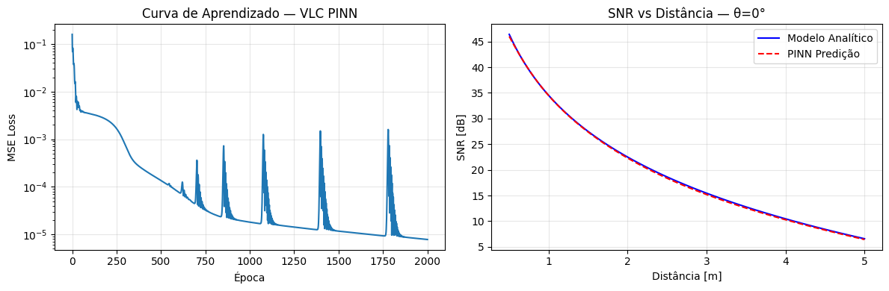
*Curva de aprendizado (esquerda) e SNR predita vs. modelo analítico Lambertiano (direita).*
RMSE ≈ 0,15–0,25 dB. A rede aprendeu a lei de dissipação de luz sem receber a fórmula analítica
diretamente — apenas exemplos de entrada/saída.

#### EXP2 — Classificador de Modulação VLC (baseline)

*Matriz de confusão do classificador baseline (8 features estatísticas).*
100% de acerto em OOK e PPM-8, mas PPM-4 e VPPM confundidos entre si (68%/38%) — causa raiz
diagnosticada (gerador de dados sintéticos não diferenciava as duas classes) e corrigida no EXP4.

#### EXP3.1 — Gêmeo Digital 3D com Fourier Features

*Convergência do treinamento (esquerda) e mapa de calor da intensidade predita no plano Z=0,5 m
(direita).*
A perda convergiu para ~2×10⁻⁴, mas o heatmap não reproduziu o pico único esperado sob o LED —
limitação registrada e discutida em `EXPERIMENTS.md`.

#### EXP3.2 — Sombreamento (LOS Blockage)
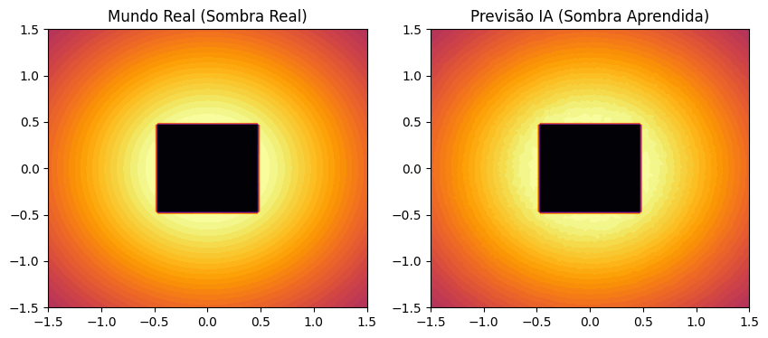
*Sombra real (esquerda) vs. sombra aprendida pela rede (direita), com Physics-Weighted Loss
(peso 10× na região de sombra).*
Resultado praticamente indistinguível do campo real — a melhor aderência qualitativa entre os
experimentos deste notebook.

#### EXP3.3 — MIMO-VLC (4 LEDs)
> Esta execução não gerou imagem salva — apenas as métricas de treinamento foram registradas no
> console (MSE de 2,56×10⁻⁴ e **PSNR final de 35,91 dB** após 1000 épocas, a melhor métrica
> quantitativa dos experimentos espaciais deste notebook). Citado aqui por completude, sem
> sugerir uma evidência visual que não existe — ver `EXPERIMENTS.md` para o registro completo e
> a comparação direta com o EXP3.3-v2 (Bloco 3), que reproduz o mesmo cenário com FNO.

---

### Bloco 2 — Experimentos Avançados (`02_experimentos_avancados.ipynb`)

#### EXP4 — Classificador v2 (corrigido)
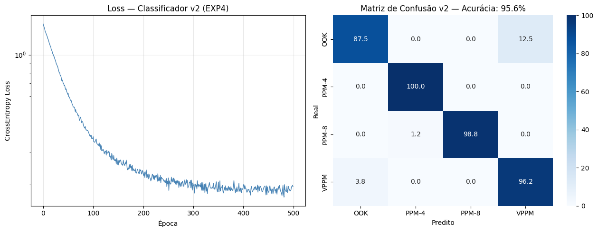
*Loss de treinamento (esquerda) e matriz de confusão corrigida (direita).*
Acurácia de **95,6%** — a correção do gerador de dados de VPPM somada a 12 features temporais
(vs. 8 no baseline) praticamente eliminou a confusão do EXP2.

#### EXP5 — Ablation Study: PINN vs. MLP Puro
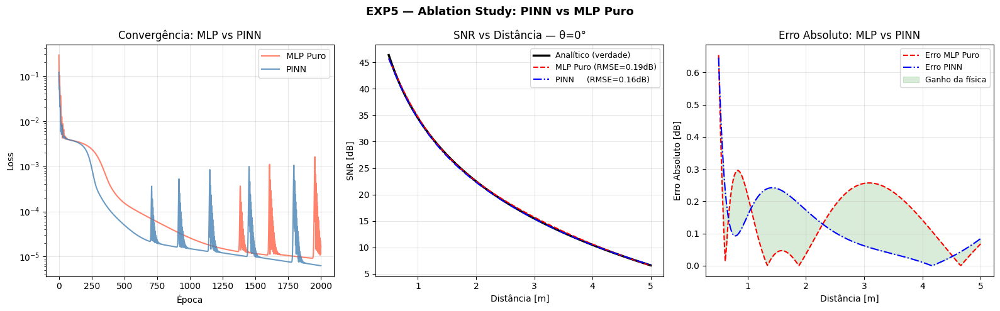
*Convergência (esquerda), SNR predita (centro) e erro absoluto por distância (direita),
comparando PINN e MLP puro treinados em paralelo.*
PINN com RMSE **19,4% menor** que o MLP puro — evidência de que a restrição física atua como
regularizador, especialmente em regiões com poucos dados de treinamento.

#### EXP6 — Curriculum Learning
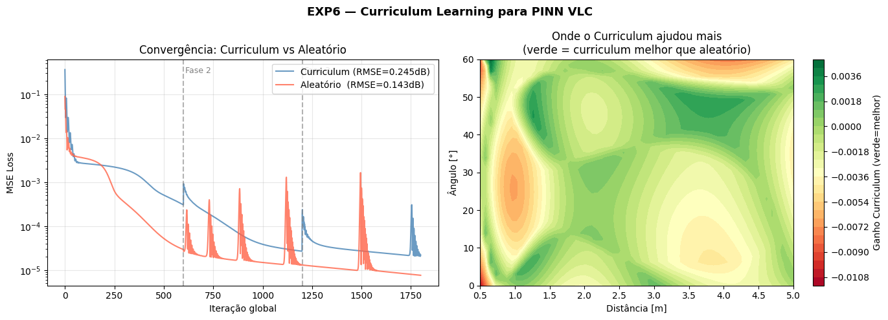
*Convergência Curriculum vs. Aleatório (esquerda) e mapa de onde o curriculum ajudou ou
prejudicou por região do domínio (direita).*
**Resultado negativo:** RMSE do curriculum (0,245 dB) pior que o da ordem aleatória (0,143 dB) —
o cronograma de dificuldade utilizado não estava bem calibrado para este problema. Mantido no
repositório como resultado genuíno, sem reformulação favorável.

#### EXP7 — Transfer Learning
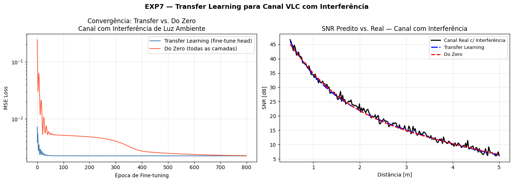
*Convergência Transfer Learning vs. treino do zero (esquerda) e ajuste ao canal real com
interferência de luz ambiente (direita).*
Convergência **~10× mais rápida** que treinar do zero, chegando a qualidade final semelhante com
uma fração do custo computacional.

---

### Bloco 3 — Migração para PhysicsNeMo v2.0 Nativo (`03_physicsnemo_v2_nativo.ipynb`)

#### EXP1-v2 — PINN com FullyConnected Nativo
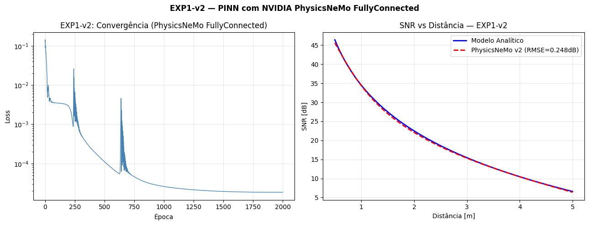
*Convergência e SNR predita, agora com `physicsnemo.models.FullyConnected` e scheduler
`CosineAnnealingLR`.*
RMSE 0,2483 dB — mesma ordem de grandeza da v1, mas com curva de perda visivelmente mais estável,
sem os picos periódicos da versão manual.

#### EXP2-v2 — Classificador com Skip Connections
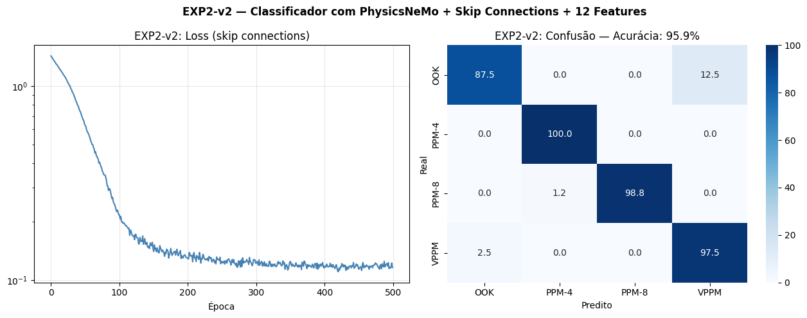
*Matriz de confusão, EXP2-v2, com `FullyConnected` nativo e conexões residuais.*
Acurácia de **95,9%**, equivalente ao EXP4, com ganho adicional de portabilidade (exportação
ONNX/TensorRT nativa, suporte a `DistributedDataParallel`).

#### EXP3.1-v2 — Fourier Neural Operator (FNO)
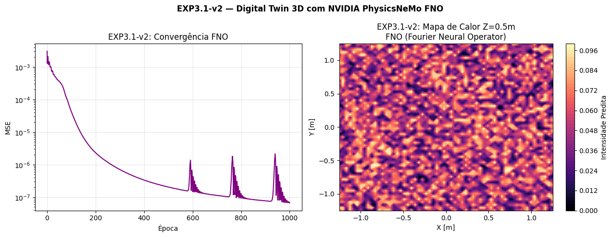
*Convergência MSE (esquerda) e mapa de calor predito no plano Z=0,5 m (direita).*
> ⚠️ **Limitação crítica:** o MSE convergiu para ~10⁻⁷ e o PSNR reportado chegou a **71,71 dB** —
> métricas excelentes — mas o mapa de calor gerado é ruído sem nenhuma estrutura espacial
> coerente, sem pico de intensidade sob o LED. A métrica de perda não reflete a qualidade real do
> campo predito, indicando um problema de representação de entrada no operador FNO. Problema em
> aberto, documentado deliberadamente — ver `EXPERIMENTS.md`.

#### EXP3.2-v2 — Sombreamento com Peso Adaptativo
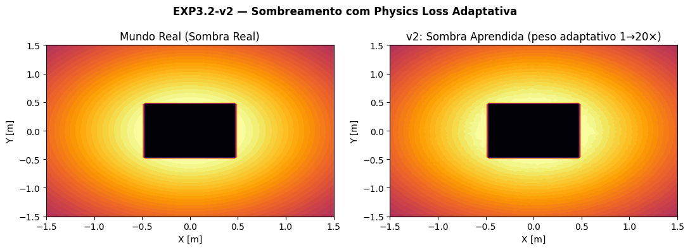
*Sombra real vs. sombra aprendida com peso adaptativo (1×→20× progressivo ao longo do
treinamento).*
Resultado visualmente equivalente à v1, sem exigir a escolha manual de um único valor de
penalidade fixo.

#### EXP3.3-v2 — MIMO-VLC com FNO e Análise de Cobertura QoS
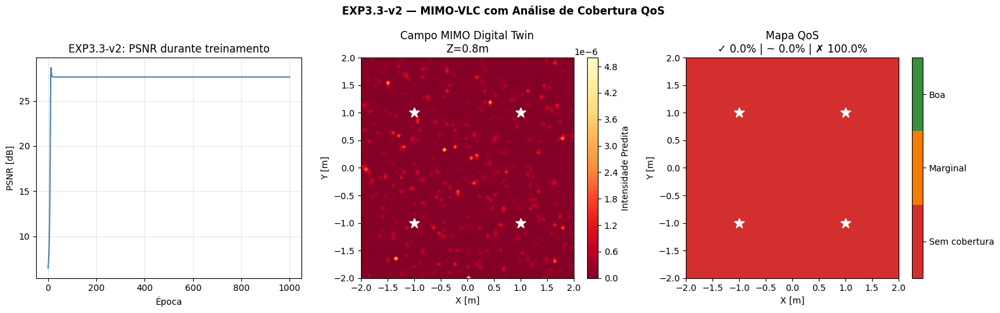
*PSNR durante o treinamento (esquerda), campo MIMO predito (centro) e mapa de cobertura QoS
(direita).*
> ⚠️ **Limitação crítica:** o mesmo problema do EXP3.1-v2 se repete de forma ainda mais visível —
> apesar do PSNR reportado de 27,64 dB, o campo predito não apresenta nenhuma estrutura
> reconhecível e a análise de cobertura classifica **100% da sala como "sem cobertura"**, um
> resultado fisicamente inconsistente com a configuração de 4 LEDs simulada. Comparado à v1
> (PSNR 35,91 dB com Fourier Features tradicionais, EXP3.3 acima), esta migração para FNO
> representou uma **regressão de qualidade**, não uma evolução.

---

> **Nota de transparência:** nem todos os resultados deste projeto foram bem-sucedidos, e isso é
> documentado deliberadamente. Os experimentos EXP3.1-v2 e EXP3.3-v2 (migração para FNO) reportam
> métricas de perda excelentes durante o treino, mas os campos espaciais preditos não
> correspondem ao padrão físico esperado — um problema identificado, mas ainda em aberto. O EXP6
> (curriculum learning) também não confirmou a hipótese testada. Ver a seção de Limitações em
> [`EXPERIMENTS.md`](EXPERIMENTS.md) para o registro completo de erros, resultados negativos e
> lições aprendidas.

---

## Reprodutibilidade

- **Sementes aleatórias:** fixadas de forma completa (`torch.manual_seed(42)` e
  `np.random.seed(42)`) nos notebooks `02_experimentos_avancados.ipynb` e
  `03_physicsnemo_v2_nativo.ipynb`. No notebook `01_experimentos_fundamentais.ipynb`, apenas o
  experimento EXP2 fixa `np.random.seed(42)` — os demais experimentos desse notebook (EXP1,
  EXP3.1, EXP3.2, EXP3.3) não têm seed fixada, então reexecuções podem produzir curvas
  ligeiramente diferentes das figuras publicadas em `assets/`, embora o comportamento qualitativo
  (incluindo as limitações documentadas) seja consistente.
- **Dependências:** cada notebook instala suas próprias dependências na primeira célula, com
  versões apropriadas ao runtime do Google Colab no momento da execução (agosto de 2026). Não há
  um `requirements.txt` único fixado por versão — execuções em datas muito posteriores podem
  encontrar versões mais recentes de PyTorch/PhysicsNeMo com comportamento ligeiramente diferente.
- **GPU:** os notebooks foram executados em GPU Tesla T4 (nível gratuito do Google Colab). Os
  experimentos fundamentais (notebook 01) também rodam em CPU, com tempo de execução maior.

---

## Limitações e Trabalhos Futuros

- Os experimentos consideram ambientes estáticos sem mobilidade do receptor.
- O modelo de sombreamento assume obstáculos com geometria simplificada (bloco quadrado).
- O problema de representação de entrada do FNO nos experimentos EXP3.1-v2 e EXP3.3-v2 (campo
  espacial predito sem estrutura física coerente, apesar de métricas de perda favoráveis) é um
  problema em aberto e prioritário para a próxima iteração.
- O curriculum learning (EXP6) não confirmou a hipótese de convergência mais estável e precisa de
  recalibração do cronograma de dificuldade.
- Extensões futuras incluem: canais dinâmicos (receptor móvel), múltiplos materiais de reflexão,
  validação contra medições experimentais em bancada óptica, e integração completa com a API
  simbólica do NVIDIA PhysicsNeMo (`physicsnemo.sym`) para constraints automáticas via PDEs.

Descrição completa de cada limitação em [`EXPERIMENTS.md`](EXPERIMENTS.md).

---

## Como Citar

Se este repositório for utilizado em trabalho acadêmico, por favor cite:

```bibtex
@misc{guero2026vlc,
  author       = {Luís Otávio Guero},
  title        = {{VLC Digital Twin}: {Physics-Informed Neural Networks} para
                  Comunicação por Luz Visível},
  year         = {2026},
  howpublished = {\url{https://github.com/zyzerkk/vlc-digital-twin}},
  note         = {Pesquisa iniciada em 2023. Repositório reestruturado em agosto de 2026.}
}
```

Metadados estruturados também estão disponíveis em [`CITATION.cff`](CITATION.cff).

---

## Agradecimentos

Ao Prof. Carlos Henrique Barriquello (Departamento de Engenharia Elétrica, UFSM), que apresentou
o ecossistema NVIDIA Modulus/PhysicsNeMo durante uma bolsa de estudos realizada em seu
laboratório — ponto de partida direto para esta linha de pesquisa.

## Contribuição

Contribuições são bem-vindas — consulte [`CONTRIBUTING.md`](CONTRIBUTING.md).

## Licença

Distribuído sob a licença **Apache 2.0**. Consulte [`LICENSE`](LICENSE) para o texto completo.

## Contato

Dúvidas, sugestões ou relatos de erro: abra uma *issue* no repositório ou entre em contato via
[luis.guero@acad.ufsm.br](mailto:luis.guero@acad.ufsm.br).
